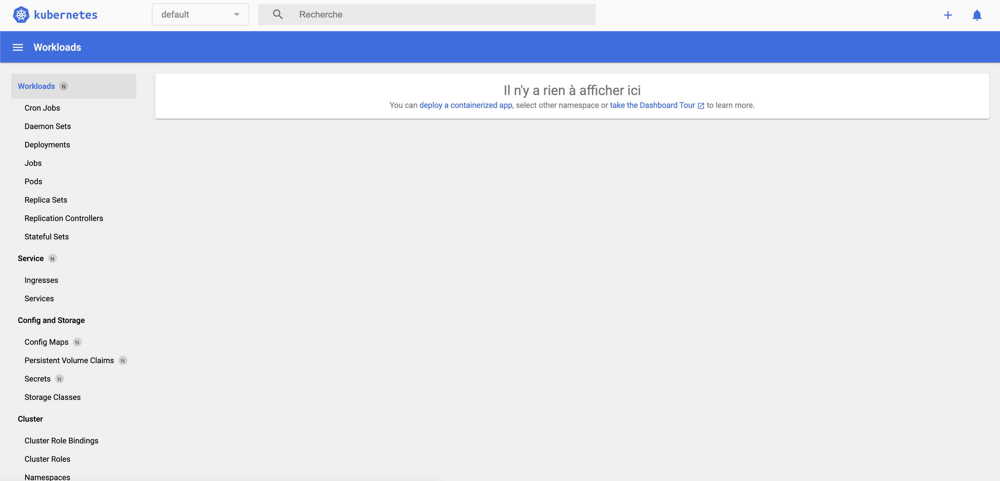

# DOJO #6 - Introduction au Chaos Engineering

## Instructions

Avant de pouvoir se lancer dans vos premières expérimentations liées au Chaos Engineering via le [Chaos Toolkit](https://chaostoolkit.org/), il va falloir installer plusieurs choses.


### Installer [Python 3](https://www.python.org/download/releases/3.0/) et créer un [environnement virtuel python](https://docs.python.org/3/tutorial/venv.html)


#### Installer [Python 3](https://www.python.org/download/releases/3.0/)

> Si vous n'avez pas Python 3 d'installé sur votre machine il faut suivre les intrusctions suivante pour l'installer :

- sous Linux 🐧
    * ```sudo apt-get install python3 python3-venv ```
- sous macOS 
    * ```brew install python3 ```


#### Créer un [environnement virtuel python](https://docs.python.org/3/tutorial/venv.html)

Afin de garder votre environnement python **bien ordonné** et **éviter les conflits entre les modules de Python**, c'est une bonne pratique de créer un **environnement virtuel python** qui sera dédiée au dojo #6.

Pour cela vous pouvez executer la commande suivante :

```python3 -m venv ~/.venvs/chaostk ```

Après avoir créé l'environnement virtuel python nommé **chaostk**, il a besoin d'être activé à l'aide de la commande :

```source ~/.venvs/chaostk/bin/activate```

Pour vérifier que vous êtes bien sous l'environnement **chaostk** vous pouvez lister les libraires à l'aide de la commande :
```
pip list
```

Normalement vous devez avoir un retour similaire à celui ci *(seulement 2 packages devrait être présents)*:
```
Package    Version
---------- -------
pip        x.y.z
setuptools x.y.z
```

Pour les expérimentations que vous allez mettre en place, vous utiliserez [Kubernetes](https://github.com/kubernetes/kubernetes) en local.

### Installer [Kubernetes](https://github.com/kubernetes/kubernetes) en local au travers de [Minikube](https://github.com/kubernetes/minikube)

[Kubernetes](https://github.com/kubernetes/kubernetes) est un outil assez répendu *(vous aurez peut-être l'occasion de le croiser en mission)*, en résumé c'est un système open-source qui vous permet d'automatiser le déploiement, le mise à l'échelle et la gestion d'applications conteneurisées.

[Minikube](https://github.com/kubernetes/minikube) permet de créer un cluster [Kubernetes](https://github.com/kubernetes/kubernetes) sur votre poste.


#### Installer le client **kubectl** 

Pour intéragir avec Kubernetes au travers de la cli nous allons utiliser le binaire **kubectl**.

##### **kubectl**
###### Linux 🐧

````
sudo apt-get update && sudo apt-get install -y apt-transport-https
````

````
curl -s https://packages.cloud.google.com/apt/doc/apt-key.gpg | sudo apt-key add -
````

````
echo "deb https://apt.kubernetes.io/ kubernetes-xenial main" | sudo tee -a /etc/apt/sources.list.d/kubernetes.list
````

````
sudo apt-get update
````

````
sudo apt-get install -y kubectl=1.23.0
````

Afficher la version de **kubectl** à l'aide de la commande

````
kubectl version --client
````

###### macOS 

````
curl -LO https://storage.googleapis.com/kubernetes-release/release/v1.23.0/bin/darwin/amd64/kubectl
````

````
chmod +x ./kubectl
````

````
sudo mv ./kubectl /usr/local/bin/kubectl
````

Afficher la version de **kubectl** à l'aide de la commande

````
kubectl version --client
````

Vous devriez avoir un retour dans la console similaire à celui ci :

````
Client Version: version.Info{Major:"1", Minor:"23", GitVersion:"v1.23.0", GitCommit:"ab69524f795c42094a6630298ff53f3c3ebab7f4", GitTreeState:"clean", BuildDate:"2021-12-07T18:16:20Z", GoVersion:"go1.17.3", Compiler:"gc", Platform:"darwin/amd64"}
````

##### **kubectx**

###### Linux 🐧
````
sudo apt-get install kubectx
````


###### macOS 
````
brew install kubectx
````


####  Installer [l'hyperviseur **Hyperkit**](https://github.com/moby/hyperkit)


#### Linux 🐧

````
    curl -LO https://storage.googleapis.com/minikube/releases/latest/docker-machine-driver-hyperkit \
    && chmod +x docker-machine-driver-hyperkit \
    && sudo mv docker-machine-driver-hyperkit /usr/local/bin/ \
    && sudo chown root:wheel /usr/local/bin/docker-machine-driver-hyperkit \
    && sudo chmod u+s /usr/local/bin/docker-machine-driver-hyperkit
````

#### macOS 

````
brew install hyperkit
````

####  Installer [Minikube](https://github.com/kubernetes/minikube)


##### Linux 🐧

````
sudo apt get install minikube
````

##### macOS 

````
brew install minikube
````


##### Créer un cluster [Kubernetes](https://github.com/kubernetes/kubernetes) avec 3 noeuds (1 master / **2 worker**)

Lancer la commande

````
minikube start --driver=hyperkit --kubernetes-version v1.23.0 --nodes 3
````

Cela déclenchera un prompt qui vous affichera les instructions en cours, ayant installé kubectx
S'assurer que vous êtes dans le bon contexte celui de minikube dans le namespace default :

````
kubectl config get-contexts
````

L'étoile doit se situer au niveau de minikube :

|CURRENT | NAME     | CLUSTER  | AUTHINFO | NAMESPACE |
| ------- | ---------- | ------- | --------- | ---------- |
|*       | minikube | minikube | minikube | default  |


Vous devez labéliser les nodes **minikube-m02** et **minikube-m03** avec le label *role=worker*

````
kubectl label nodes minikube-m02 minikube-m03 role=worker
````

Cela vous affichera le retour suivant :

````
node/minikube-m02 labeled
node/minikube-m03 labeled
````

Afin d'avoir la possibilité d'observer au travers d'une GUI se qu'il se passe sur notre cluster minikube vous devez installer ces addons **metrics-server** et **dashboard** avec la commande :

````
minikube addons enable metrics-server && minikube addons enable dashboard
````

Ouvrez une nouvelle fenêtre dans notre terminal et tapez la commande suivante elle ouvrira une page sur votre navigateur  *(si vous coupez cette commande vous n'aurait plus accès au dashboard)* :

`````
minikube dashboard
`````

Vous devriez arriver sur cette page d'accueil :



## Installer [Chaos Toolkit](https://github.com/chaostoolkit/chaostoolkit)

Il suffit d'éxecuter la commande suivante depuis votre environnement virtuel python **chaostk** (que vous avez précédemment): 

```
pip install chaostoolkit
```

Pour vérifier qu'il est bien installé, il faut executer la commande  :

```
chaos --help
```

Chaos Toolkit par défaut ne connaît rien à Kubernetes c'est pour cela qu'un driver a été développé, il suffit de l'installer toujours depuis l'environnement virtuel python chaostk à l'aide de la commande :

```
pip install chaostoolkit-kubernetes kubernetes==21.7.0
```


> 👍 Si vous êtes arrivé à cette ligne c'est que tout est installé et vous allez pouvoir passer aux expérimentaions 🎉
> Pour la première experimenation ouvrir le dossier [experimentation1](./experimentation1/README.md)
> Pour la seconde experimenation ouvrir le dossier [experimentation2](./experimentation2/README.md)