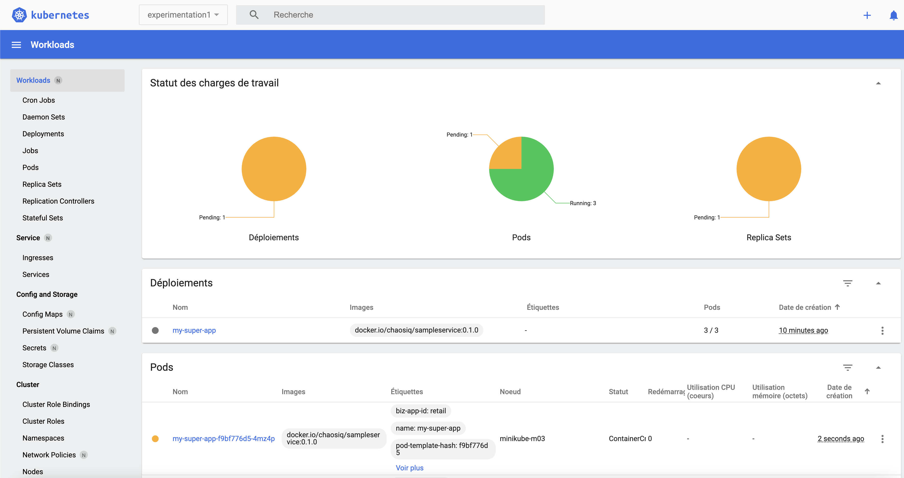

La solution était S C A L E - U P! Augmenter le nombre de pod

Appliquez la solultion :
````
kubectl apply -f solution/deployment.yaml
````

Attendez que la solution se déploie correctement (état running).

Relancer l'experimentation :

````
chaos run experiment_1_deleting_pod.yaml
````


Vous pouvez constater dans l'interface que désormais avec la solution mise en place même si un pod est supprimé il y en a 2 autres pour tenir accueillir le traffic :



côté sortie console :
````
[INFO] Validating the experiment's syntax
[INFO] Experiment looks valid
[INFO] Running experiment: Mon application est résiliente au drainage de noeuds
[INFO] Steady-state strategy: default
[INFO] Rollbacks strategy: default
[INFO] Steady state hypothesis: Mon application est disponible
[INFO] Probe: ma-super-app-repond-normalement
[INFO] Steady state hypothesis is met!
[INFO] Playing your experiment's method now...
[INFO] Action: terminate-db-pod
[INFO] Pausing after activity for 5s...
[INFO] Steady state hypothesis: Mon application est disponible
[INFO] Probe: ma-super-app-repond-normalement
[INFO] Steady state hypothesis is met!
[INFO] Let's rollback...
[INFO] No declared rollbacks, let's move on.
[INFO] Experiment ended with status: completed
````

# 🎉 Félicitations vous êtes arrivé au terme de cette première expérimentation !