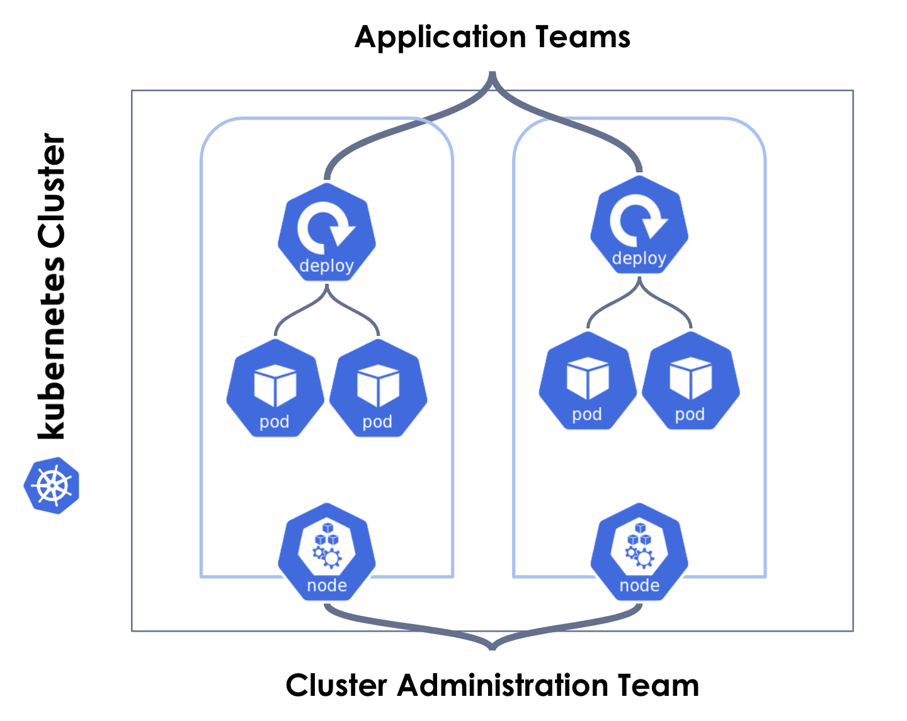
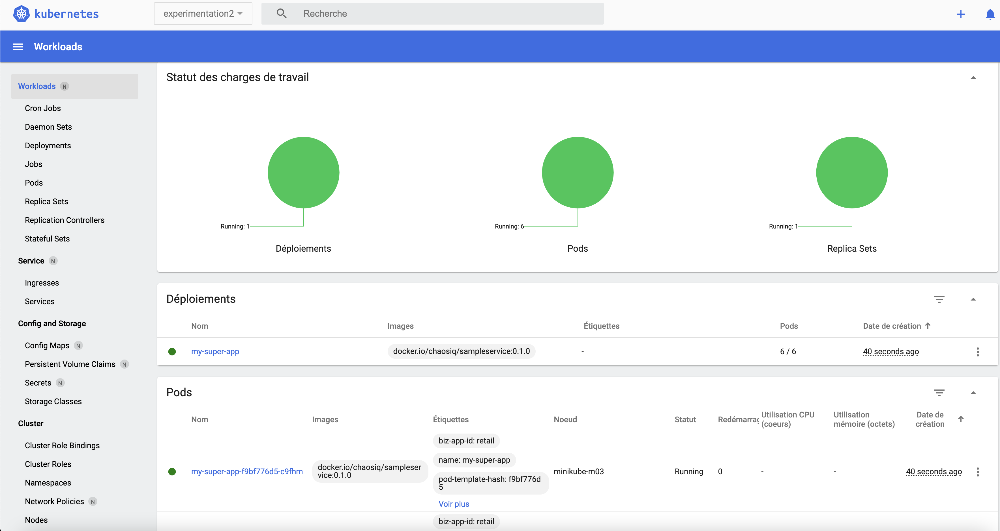
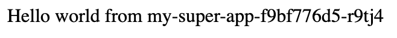
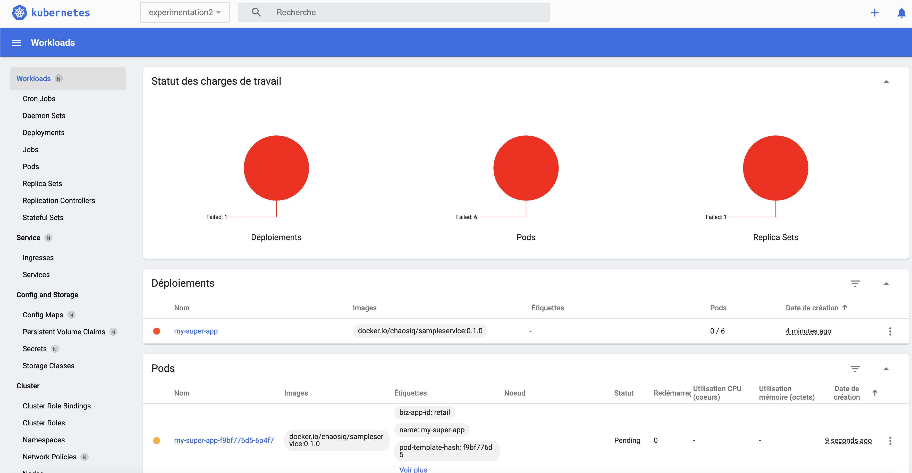

# Experimentation 2 : 🔄 Drainage d'un noeud
> 🚨 Avant tout chose vérifiez si vous êtes bien dans le bon contexte, à savoir celui de **minikube** toujours à l'aide de la commande :
````
kubectl config get-contexts
````

Supprimez le namespace de la première experimentation
````
kubectl delete namespace experimentation1
````

## Contexte

Pour cette seconde experimentation voici le contexte dans lequel vous allez interagir.




L'équipe métier celle qui gère l'application souhaite que son application soit disponible **à tout prix** !
Aucune indisponiblité ne doit survenir, en effet aujourd'hui c'est le lancement de son nouveau produit !

Vous faites partie de l'équipe qui gère le cluster kubernetes c'est donc de votre ressort de vous assurer qu'aucune indisponibilité ne survienne.


### Instructions

Créer un namespace appelé *experimentation2* :

````
kubectl create namespace experimentation2
````

Voici la sortie de la console attendue :

````
namespace/experimentation2 created
````

Placez vous dans le dossier *experimentation2*  :
````
cd experimentation2
````

Placez vous dans ce namespace *experimentation2* :
````
kubectl config set-context --current --namespace=experimentation2
````

Vous pouvez appliquer les fichiers de ressources mis à votre disposition il y'a un deployment et un service, à l'aide de la commande :
`````
kubectl apply -f deployment.yaml && kubectl apply -f service.yaml
`````

Vérifier que les 6 pods sont à l'état running soit au travers de la cli soit au travers du dashboard (que vous avez ouvert précédement) :

`````
kubectl get pods -owide
`````




Récupérer l'url via cette commande, garder l'url car il faudra la renseigner dans le fichier de l'experimentation 2 à la ligne 30 [experiment_2_draining_nodes](./experiment_2_draining_nodes.yaml)  :

````
minikube service list -n experimentation2
````

|    NAMESPACE     |    NAME    | TARGET PORT |            URL             |
|------------------|------------|-------------|----------------------------|
| experimentation2 | my-service |        8080 | url à récupérer et à coller à la ligne 30 du fichier [experiment_2_draining_nodes](./experiment_2_draining_nodes.yaml) |


Vous devez arriver sur une page similaire à celle-ci :


Regarder commment est constitué le fichier [experiment_2_draining_nodes](./experiment_2_draining_nodes.yaml).
N'oubliez pas de remplacer l'url à la ligne 30 par la votre !

Vous l'aurez remarqué nous avons 1 action de drainage de noeud qui va être jouée !

L'objectif c'est d'observer lorsque cette action de drainage surviendra comment cela impactera notre l'application.


Vous allez pouvoir en premier lieu valider la syntaxe de la seconde expérimentation à l'aide de la commande :
````
chaos validate experiment_2_draining_nodes.yaml
````

Puis vous allez pouvoir lancer l'expérimentation, sans activer la procédure de rollback volontairement pour observer ce qu'il se passe :
````
chaos run experiment_2_draining_nodes.yaml
````

Regardez ce qu'il se passe côté dashboard, il semble que notre deploiement a été fortement impacté :



Si vous observez l'état de vos noeuds à l'aide de la commande :
````
kubectl get nodes  -l=role=worker
````

Vous constaterez qu'ils sont à l'état *Ready* mais avec le status supplémentaire *SchedulingDisabled*, c'est du au fait de l'action *drain_nodes* :
````
NAME           STATUS                     ROLES    AGE   VERSION
minikube-m02   Ready,SchedulingDisabled   <none>   30m   v1.23.0
minikube-m03   Ready,SchedulingDisabled   <none>   29m   v1.23.0
````

Du côté de la sortie de la console vous aurez une sortie similaire :
````
[INFO] Validating the experiment's syntax
[INFO] Experiment looks valid
[INFO] Running experiment: Mon application est résiliente au drainage de noeuds
[INFO] Steady-state strategy: default
[INFO] Rollbacks strategy: default
[INFO] Steady state hypothesis: Les services sont tous disponible et en bonne santé
[INFO] Probe: pods_in_phase
[INFO] Probe: ma-super-app-repond-normalement
[INFO] Steady state hypothesis is met!
[INFO] Playing your experiment's method now...
[INFO] Action: drain_nodes
[INFO] Steady state hypothesis: Les services sont tous disponible et en bonne santé
[INFO] Probe: pods_in_phase
[ERROR]   => failed: chaoslib.exceptions.ActivityFailed: pod 'biz-app-id=retail' is in phase 'Pending' but should be 'Running'
[WARNING] Probe terminated unexpectedly, so its tolerance could not be validated
[CRITICAL] Steady state probe 'pods_in_phase' is not in the given tolerance so failing this experiment
[INFO] Experiment ended with status: deviated
[INFO] The steady-state has deviated, a weakness may have been discovered
````

Procédez à l'opération de rollback manuellement :
````
kubectl uncordon -l=role=worker
````

Afin de relancer l'expéremimentation dans sa totalité en incluant l'opération de rollback, lancez la commande suivante :
````
chaos run experiment_2_draining_nodes.yaml --rollback-strategy=always
````

Que s'est t'il passé durant cette experimentation ?
>

# 🎉 Félicitations vous avez observé une faiblesse ! Il y'a bien un problème dans la configuration actuelle !

Que pourrions nous faire *très simplement* pour éviter ce genre de situation ?
> La réponse est de mettre en place la ressource kubernetes nommée P _ D - D _ _ _ _ _ _ _ _ _ _ N - B _ _ _ _ T

La solution se trouve ici [solution détaillée](solution/README.md)
