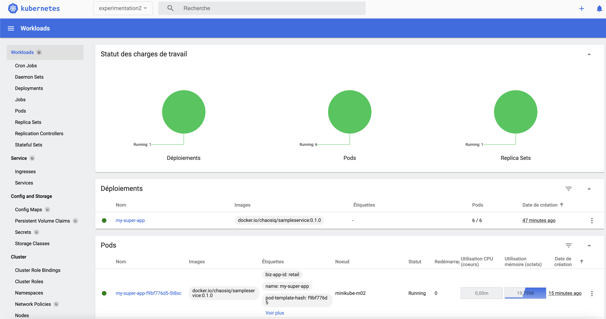

La solution était P O D - D I S T R I B U T I O N - B U D G E T ! 

Le [poddistributionbudget](https://kubernetes.io/docs/concepts/workloads/pods/disruptions/#pod-disruption-budgets) ou plus couramment appelé pdb est une ressource Kubernetes qui va limiter le nombre de pods d'une application qui sont indisponibles simultanément suite à une action disruptive.

En mettant en place le pdb et en spécifiant que le nombre minimum de pods qui doivent être simultanément disponibles est de 6 l'action de drainage n'aura pas lieu.

Appliquez la solultion :
````
kubectl apply -f solution/poddistributionbudget.yaml
````

Relancer l'experimentation :

````
chaos run experiment_2_draining_nodes.yaml
````

Vous pouvez constater dans l'interface que désormais avec la solution mise en place aucun noeud n'a été marqué en *SchedulingDisabled* car le drainage n'a pas eu lieu :
````
NAME           STATUS   ROLES    AGE   VERSION
minikube-m02   Ready    <none>   71m   v1.23.0
minikube-m03   Ready    <none>   71m   v1.23.0
````

Côté pod aucun n'a été affecté :


côté sortie console :
````
[INFO] Validating the experiment's syntax
[INFO] Experiment looks valid
[INFO] Running experiment: Mon application est résiliente au drainage de noeuds
[INFO] Steady-state strategy: default
[INFO] Rollbacks strategy: default
[INFO] Steady state hypothesis: Les services sont tous disponible et en bonne santé
[INFO] Probe: pods_in_phase
[INFO] Probe: ma-super-app-repond-normalement
[INFO] Steady state hypothesis is met!
[INFO] Playing your experiment's method now...
[INFO] Action: drain_nodes
[ERROR]   => failed: chaoslib.exceptions.ActivityFailed: Failed to evict pod my-super-app-f9bf776d5-5t8xc: {"kind":"Status","apiVersion":"v1","metadata":{},"status":"Failure","message":"Cannot evict pod as it would violate the pod's disruption budget.","reason":"TooManyRequests","details":{"causes":[{"reason":"DisruptionBudget","message":"The disruption budget my-super-app-pdb needs 6 healthy pods and has 6 currently"}]},"code":429}
[INFO] Steady state hypothesis: Les services sont tous disponible et en bonne santé
[INFO] Probe: pods_in_phase
[INFO] Probe: ma-super-app-repond-normalement
[INFO] Steady state hypothesis is met!
[INFO] Let's rollback...
[INFO] Rollback: uncordon_node
[INFO] Action: uncordon_node
[INFO] Experiment ended with status: completed
````

# 🎉 Félicitations vous êtes arrivé au terme de la dernière expérimentation de ce dojo !